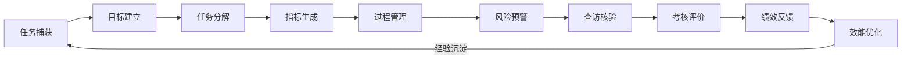
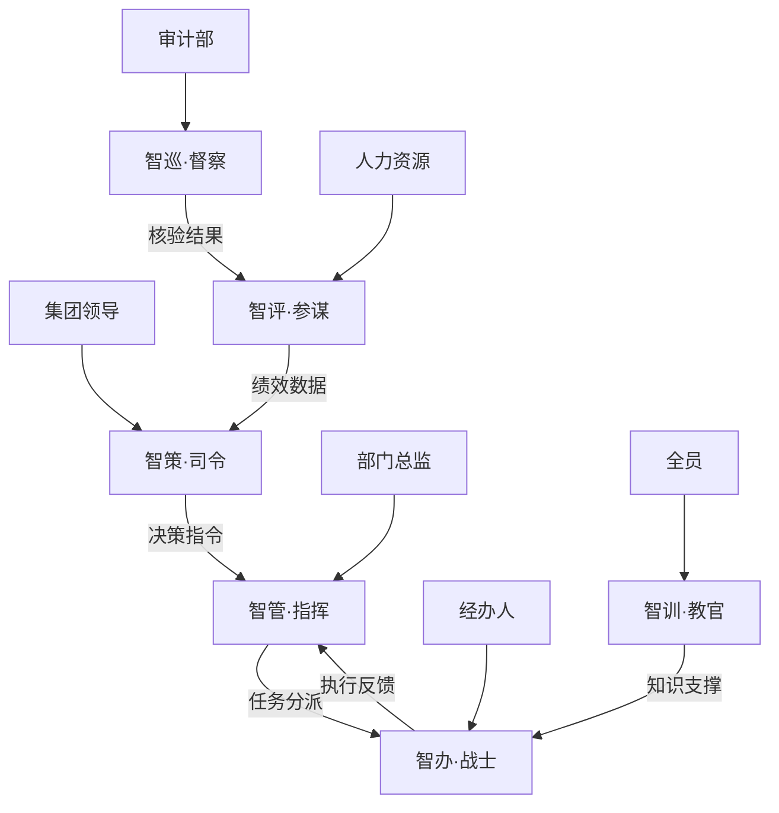

## 1. 产品概述

集团·智理通 V4.0 是一套面向集团总部的 AI 原生效能管理平台，以"四库一图"为知识底座、"十大环节"为业务链路、"六员协同"为智能体编组、"对话即操作"为交互范式，实现从任务捕获到效能优化的全链路智能化闭环。

- 解决集团总部绩效管理中"数据孤岛、流程断裂、考核主观、经验流失"四大痛点
- 目标用户：集团领导、部门总监、一线经办人、审计部、人力资源部、全员

## 2. 核心功能

### 2.1 用户角色

| 角色 | 登录方式 | 核心权限 |
|------|----------|----------|
| 集团领导 | 统一认证 | 全局态势感知、决策支持、一键督办 |
| 部门总监 | 统一认证 | 部门任务管理、进度追踪、人员调度 |
| 一线经办人 | 统一认证 | 任务执行、材料上传、进度更新 |
| 审计人员 | 统一认证 | 查访核验、问题跟踪、合规检查 |
| 人力资源 | 统一认证 | 绩效计算、画像生成、评优分析 |
| 全员 | 统一认证 | 知识检索、经验学习、智能问答 |

### 2.2 功能模块

1. **总览首页**：全局态势仪表盘、快捷入口、实时预警
2. **四库一图**：指标库管理、知识库检索、绩效库分析、经验案例库浏览、知识图谱可视化
3. **十大环节**：任务捕获→目标建立→任务分解→指标生成→过程管理→风险预警→查访核验→考核评价→绩效反馈→效能优化全流程可视化
4. **六员工作台**：智策（领导驾驶舱）、智管（部门工作台）、智办（经办人助手）、智巡（审计核验）、智评（考核评价）、智训（知识助手）
5. **对话即操作**：AI 对话交互界面，支持自然语言操作所有功能

### 2.3 页面详情

| 页面名称 | 模块名称 | 功能描述 |
|----------|----------|----------|
| 总览首页 | 态势仪表盘 | 展示红灯/黄灯/绿灯项目、战略目标完成率、部门排名、智能建议 |
| 总览首页 | 快捷入口 | 六员工作台快速切换、十大环节流程入口 |
| 四库一图-指标库 | 指标管理 | 指标列表、指标详情、维度筛选、公式配置、权重调整 |
| 四库一图-知识库 | 知识检索 | 制度文件检索、部门职责查询、业务流程浏览、术语解释 |
| 四库一图-绩效库 | 绩效分析 | 考核评分查询、画像报告查看、排名趋势、奖惩记录 |
| 四库一图-经验案例库 | 案例浏览 | 成功/失败案例、最佳实践、问题案例、创新案例检索 |
| 四库一图-知识图谱 | 图谱可视化 | 实体关系图、跨库关联、路径推理、交互式探索 |
| 十大环节 | 流程全景 | 十大环节流程图、当前环节高亮、环节详情弹窗 |
| 十大环节 | 任务捕获 | 多渠道任务来源列表、AI识别结果、任务卡片生成 |
| 十大环节 | 目标建立 | 目标卡列表、战略解码、任务聚合、目标详情 |
| 十大环节 | 任务分解 | 任务分解树、部门分派、合理性校验 |
| 十大环节 | 指标生成 | 指标-职责匹配、权重配置、指标推荐 |
| 十大环节 | 过程管理 | 进度跟踪、材料归档、汇报生成 |
| 十大环节 | 风险预警 | 风险看板、红黄绿灯、预警通知 |
| 十大环节 | 查访核验 | 核验任务列表、现场记录、材料比对 |
| 十大环节 | 考核评价 | 自动评分、体检画像、亮点识别 |
| 十大环节 | 绩效反馈 | 反馈报告、对比分析、申诉处理 |
| 十大环节 | 效能优化 | 瓶颈识别、流程优化、最佳实践沉淀 |
| 智策工作台 | 领导驾驶舱 | 红灯项目、部门红黑榜、战略目标完成率、一键督办 |
| 智管工作台 | 部门工作台 | 部门项目进展、人员负载、知识库动态 |
| 智办工作台 | 经办人助手 | 个人待办、材料智搜、智能填报、合规校验 |
| 智巡工作台 | 审计核验 | 核验任务、问题闭环、合规检查 |
| 智评工作台 | 考核评价 | 自动评分、画像生成、评优推荐 |
| 智训工作台 | 知识助手 | 制度问答、经验检索、案例学习 |
| 对话即操作 | AI对话 | 自然语言交互、意图识别、操作执行、上下文记忆 |

## 3. 核心流程

用户通过对话或界面操作，完成从任务捕获到效能优化的全链路管理：

六员协同流程：

## 4. 用户界面设计

### 4.1 设计风格

- **主色调**：深蓝(#1a365d) + 金色(#d4a843)，体现集团权威与智能科技感
- **辅助色**：翠绿(#38a169)表示正常/完成，琥珀(#dd6b20)表示警告，红色(#e53e3e)表示危险/超期
- **按钮风格**：圆角矩形，主按钮深蓝底白字，次按钮白底蓝边
- **字体**：标题用思源黑体/Noto Sans SC Bold，正文用系统默认无衬线字体
- **布局风格**：左侧导航栏 + 顶部面包屑 + 主内容区卡片式布局
- **图标风格**：线性图标(Lucide)，统一2px描边

### 4.2 页面设计概览

| 页面名称 | 模块名称 | UI元素 |
|----------|----------|--------|
| 总览首页 | 态势仪表盘 | 深色渐变背景、大数字卡片、环形进度图、红黄绿灯指示器 |
| 四库一图-知识图谱 | 图谱可视化 | 深色背景、力导向图、节点高亮、关系线动画 |
| 智策工作台 | 领导驾驶舱 | 深色主题、数据大屏风格、实时刷新动画 |
| 对话即操作 | AI对话 | 右侧浮动面板、气泡式对话、操作卡片嵌入 |

### 4.3 响应式设计

- 桌面端优先（1920×1080为基准）
- 平板端适配（1024×768）
- 移动端基础适配（375×667）

### 4.4 动效设计

- 页面切换：淡入淡出
- 数据加载：骨架屏
- 卡片悬停：微上浮 + 阴影加深
- 图表更新：平滑过渡动画
- 预警闪烁：红灯项目脉冲动画
