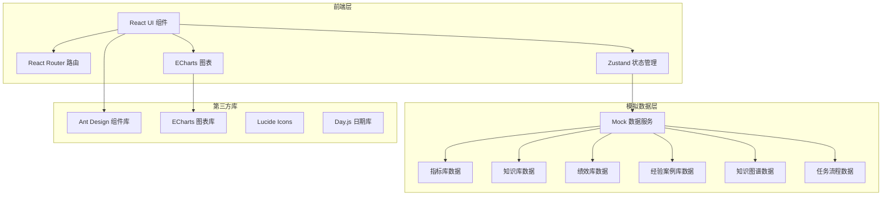
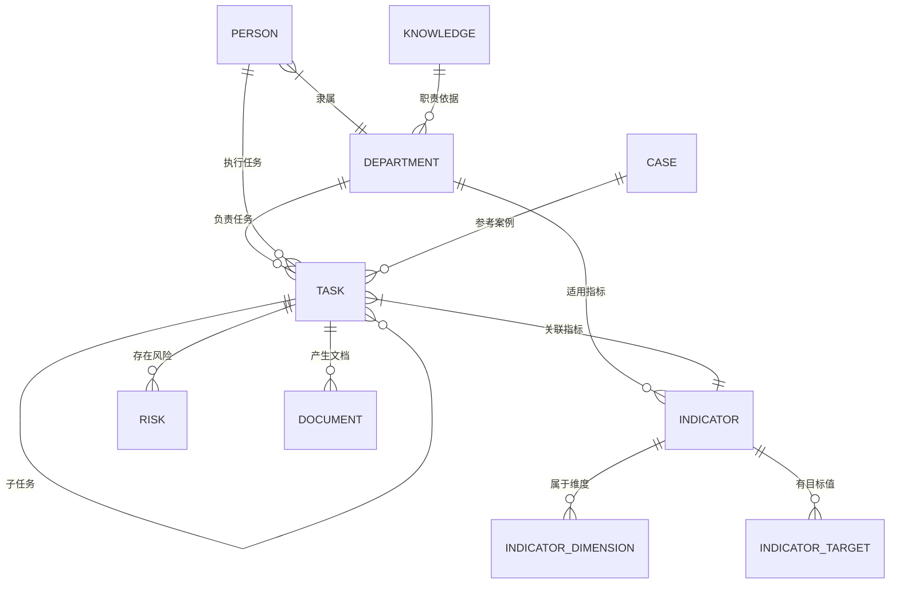

## 1. 架构设计

## 2. 技术说明

- **前端框架**：React 18 + TypeScript + Vite
- **UI 组件库**：Ant Design 5.x
- **样式方案**：Tailwind CSS 3.x + Ant Design Token 主题定制
- **状态管理**：Zustand
- **路由**：React Router DOM 6.x
- **图表可视化**：ECharts 5.x（通过 echarts-for-react）
- **知识图谱可视化**：ECharts Graph（力导向布局）
- **图标**：Lucide React
- **日期处理**：Day.js
- **数据层**：前端 Mock 数据（无后端依赖）
- **初始化工具**：vite-init (react-ts 模板)

## 3. 路由定义

| 路由 | 用途 |
|------|------|
| `/` | 总览首页 - 态势仪表盘 |
| `/dashboard/zhice` | 智策工作台 - 领导驾驶舱 |
| `/dashboard/zhiguan` | 智管工作台 - 部门工作台 |
| `/dashboard/zhiban` | 智办工作台 - 经办人助手 |
| `/dashboard/zhixun` | 智巡工作台 - 审计核验 |
| `/dashboard/zhiping` | 智评工作台 - 考核评价 |
| `/dashboard/zhixun2` | 智训工作台 - 知识助手 |
| `/repository/indicator` | 四库一图 - 指标库 |
| `/repository/knowledge` | 四库一图 - 知识库 |
| `/repository/performance` | 四库一图 - 绩效库 |
| `/repository/case` | 四库一图 - 经验案例库 |
| `/repository/graph` | 四库一图 - 知识图谱 |
| `/workflow` | 十大环节 - 流程全景 |
| `/workflow/:stage` | 十大环节 - 各环节详情 |
| `/chat` | 对话即操作 - AI对话 |

## 4. 数据模型

### 4.1 核心数据模型定义

### 4.2 模拟数据定义

所有数据使用 TypeScript 接口定义，存储在 `src/mock/` 目录下：

- `indicatorData.ts`：指标库数据（20+条指标）
- `knowledgeData.ts`：知识库数据（制度文件、部门职责、业务流程）
- `performanceData.ts`：绩效库数据（评分、排名、画像）
- `caseData.ts`：经验案例库数据（成功/失败/最佳实践案例）
- `graphData.ts`：知识图谱数据（实体、关系、节点位置）
- `taskData.ts`：任务流程数据（十大环节各阶段任务）
- `departmentData.ts`：部门与人员数据
